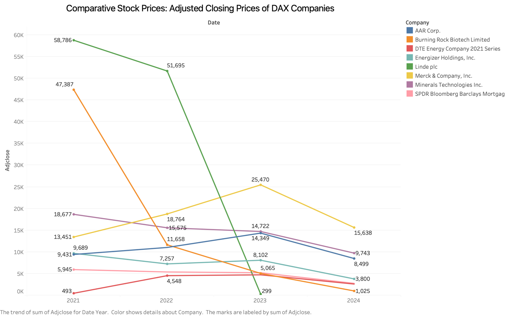
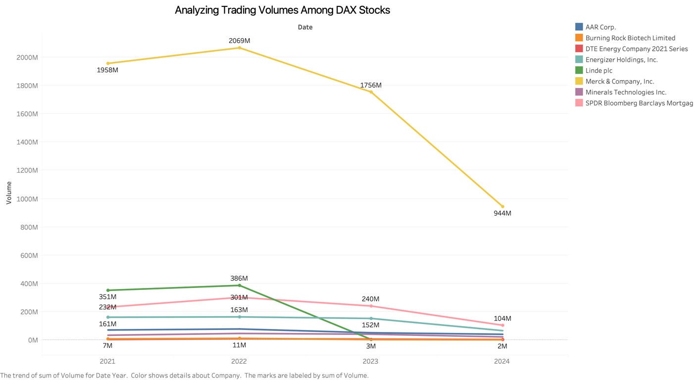
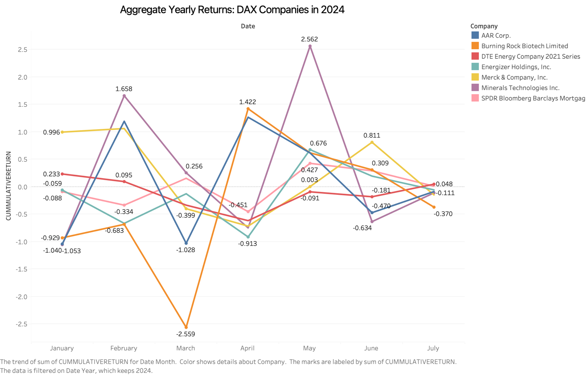
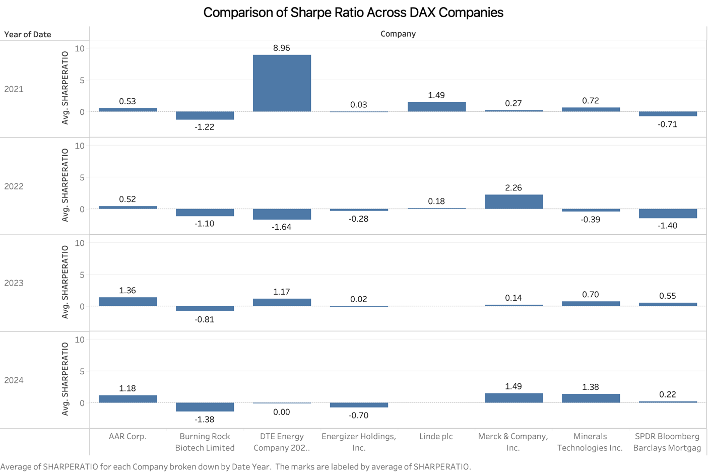
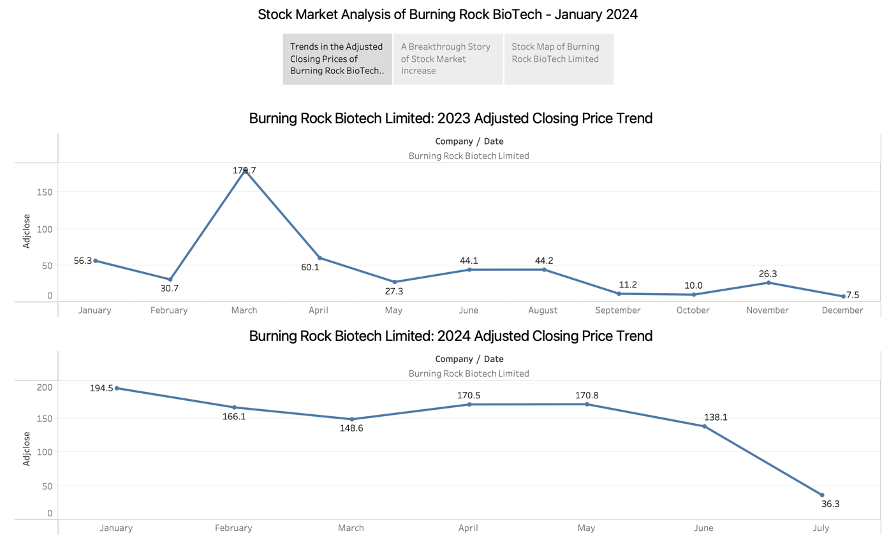

<h1> STOCK MARKET ANALYSIS ON DAX COMPANIES </h1>

**Abstract:**

This project focuses on examining the variances in the stock market
performance among DAX companies over a three-year period. Utilizing
stock market data obtained from the Yahoo and Alpha Vantage APIs, the
study aims to identify the primary factors influencing these
fluctuations and get insights into deeper understanding of market
trends. Despite limitations such as the absence of historical data and
potential differences in data quality across platforms, the analysis
seeks to provide a complete summary of performance trends. Assumptions
include the sufficient data of the chosen timeframe for proper trend
analysis and the dependability of the real-time data used. Recognizing
potential limitations, such as incomplete analysis due to limited
historical data and reliance on external data sources, steps are made to
ensure the data integrity and validity of the findings.

**Keywords:**

DAX companies, stock market analysis, performance trends, market
fluctuations, Yahoo API, Alpha Vantage API, stock price factors, trend
analysis

**1) Introduction:**

The dynamic nature of the stock market requires deeper analysis to
understand the performance trends of DAX companies. This project aims to
delve into the stock market fluctuations experienced by DAX companies
over a three-year period. By examining stock market data sourced from
reliable APIs such as Yahoo and Alpha Vantage, we seek to identify and
understand the factors contributing to these fluctuations. The insights
gained will provide a comprehensive understanding of the market behavior
of DAX companies, offering valuable information for investors, analysts,
and stakeholders.

**2) Methods:**

The research on the stock information has been conducted with the
various techniques and methods such as below:

**2.1) Data Preprocessing:**

Data preprocessing is a key process in any data-driven project, since it
involves in cleaning, transforming, and preparing raw data into a
meaningful model. This section describes the systematic approach used to
refine the dataset for following analytical tasks

**2.1.1) Data Availability:**

Data availability refers to the process of ensuring that the required
data for analysis is readily available and accurate. This subsection
describes how the data on ticker symbols as well as associated
information were gathered for the DAX companies included in the study.

**2.1.1.1) Ticker Symbol Information:**

The ticker symbols for this research on DAX companies were collected
using the pyTickerSymbols Python package. We chose data for DAX
companies that are readily available for the period of 3 years, ensuring
comprehensive analysis. The data selection for the source code is
**\[Mentioned in Appendix 3\].**

**2.1.1.2) Ticker Information with Historical Data:**

The ticker information for this research on DAX companies was collected
from Yahoo Finance API using a caching approach to prevent server
overload. This data covers the period from 2021 until the present. It
includes two types of data: company-related information, which is stored
directly as a data lake table, and historical data, which will be used
for further analysis **\[Source code mentioned in Appendix 3\].**

**2.1.2) Data Analysis:**

Data analysis were performed using the \"Stock Information.xlsx\"
workbook **\[mentioned in Appendix 1\],** and the relevant assumptions
were made based on data accessed via API. Table structure was concluded
based on the findings of the ticker information collected which was
loaded directly into the data lake table named \"TICKER_INFO,\" and the
historical data was sent for further processing.

**2.1.3) Data Validation:**

Data validation was performed directly without any transformation, as
all the columns are numerical. New attributes, such as ticker symbol and
date, were included to uniquely identify each record **\[Attribute
details are mentioned in Appendix 1\].**

The following data validations were performed on the source records:

-   Deduplication: Removed duplicate records to main uniqueness

-   Null check Exclusion: Identified and handled null values to maintain
    data integrity.

-   Mean Imputation: Replaced missing values with the mean of the
    respective columns to maintain consistency and accuracy.

-   Biases Fix: Corrected biases such as removing outliers using z-score
    method in the data to ensure a fair visual representation of the
    information.

These validation steps were critical in ensuring the quality and
reliability of the data used for further analysis. Records that are
satisfied the given conditions were sent for further processing,
allowing for a more accurate analysis of stock trends and behaviors.

Records that did not fit the criteria were rejected and stored in a
separate table named \"STOCK_HISTORY_REJECT,\" along with the reason for
rejection. This method ensured clarity and provided a reference for
correcting data quality issues. The rejected records table provides
future reference, that no data is permanently discarded without thorough
examination

**2.1.4) Data Readiness:**

After filtering out unnecessary records, we included new columns
**\[Mentioned in Appendix 1\]** using statistical formulas **\[Mentioned
in Appendix 3\]** to improve DAX company performance. Once these columns
were integrated, the enriched dataset was stored in the
\"STOCK_HISTORY\" as data mart table, allowing for comprehensive trend
analysis and strategic decision-making based on historical stock data.
This methodology ensures that our data infrastructure can provide strong
insights into market trends, directing effective business initiatives
and improving operational efficiencies.

**2.2) Other Data Sources:**

Stock trend analysis web scraping has been using the Alpha Vantage API.
The extracted data includes feed-related information as well as unique
identifiers like publication time and DAX company symbols. Upon
extracting and identifying the necessary data, it was then loaded into
the \"ARTICLES table\" structured as **\[Mentioned in Appendix 1\].**

**2.3) Results:**

This section presents the findings derived from the analysis of various
metrics and trends observed during the study.

**2.3.1) Comparative Stock Prices: Adjusted Closing Prices of DAX
Companies:**

The following line graph offers a detailed visual representation of the
adjusted closing prices of various DAX companies from 2021 to 2024. Each
company is represented by a separate-colored line, with labels
identifying them on the right side of the graph. The x-axis spans the
years (2021 to 2024), while the y-axis denotes adjusted closing prices
in thousands (k) **\[Mentioned in Appendix 5\].**

{width="6.355141076115485in"
height="3.4652777777777777in"}

These observations lead to numerous significant conclusions concerning
the performance of the companies being tracked. The significant decrease
of the Burning Rock Biotech Limited highlights the market instability
for the biotech industry. In contrast, DTE Energy Company 2021 Series
shows a stable but dropping pattern, indicating a continued market
presence in the face of wiper economic disruptions. Furthermore, the
diverse paths of the other companies such as Energizer Holdings, Inc.,
Linde plc, and SPDR Bloomberg Barclays Mortgag reveal indicate slight
growth patterns, stabilization, or decline affected by industry-specific
characteristics and market conditions. These findings highlight the
necessity of maintaining adjusted closing prices over time to assess
financial performance and market trends impacting each DAX company
within the DAX index.

**2.3.2) Analyzing Trading Volumes Among DAX Stocks:**

The plot of trade volume data for the analysed DAX companies shows
distinct patterns over time. AAR Corp. and Merck & Company, Inc. start
with stable volumes in 2021, but both experience a fall by 2024 due to
internal issues affecting market engagement. Burning Rock Biotech
Limited consistently shows the lowest trading volumes across all years,
suggesting a steady but narrow market presence. DTE Energy Company 2021
Series, Energizer Holdings, Inc., Minerals Technologies Inc., and SPDR
Bloomberg Barclays Mortgag trade volumes remains consistent from 2021 to
2023, with a decline visible by 2024. Linde plc stands out with a peak
in trading volume in 2022, followed by a considerable fall by 2024,
potentially affected by industry developments **\[Mentioned in Appendix
5\].**

{width="6.388888888888889in"
height="3.490972222222222in"}

These findings support numerous significant conclusions on the trading
behaviors of the companies evaluated. Firstly, the overall trend of
declining trading volumes across several companies indicates a possible
shift in market trends. over the years analyzed. Secondly, the
consistent low volume of Burning Rock Biotech Limited suggests a
specialized operational challenge impacting wider investor interest.
Lastly, the fluctuation in volumes for Linde plc highlights that the
influence of strategic decisions may have influenced its market
behavior. These findings highlight the significance of monitoring
trading volumes as a measure of market awareness and company performance
in financial environments.

**2.3.3) Aggregate Yearly Returns: DAX Companies in 2024**

The below figure **\[Mentioned in Appendix 5\]** shows the monthly
returns of various DAX companies from January to July for the year 2024.
In January, SPDR Bloomberg Barclays Mortgage had the highest return at
0.996, while DTE Energy Company has the lowest return of -1.053.
February continued with SPDR Bloomberg Barclays Mortgage leading at
1.658, while DTE Energy Company again showed the lowest return at
-2.559, alongside mostly negative returns for other companies. March saw
Merck & Company, Inc. had the highest return of 1.422, compared to DTE
Energy Company\'s lowest return of -2.559. By April, Merck & Company,
Inc. had an outstanding growth with a return of 0.676, while Energizer
Holdings, Inc. showed had the lowest return at -0.913. In May and June,
Merck & Company, Inc. maintained its lead with returns around 0.427 to
0.811, while DTE Energy Company consistently had the lowest returns, but
they have less negative than previous months. July showed most companies
nearing 0 returns, with Merck & Company, Inc. at 0.048 and DTE Energy
Company at -0.470

{width="6.388888888888889in"
height="4.086111111111111in"}

In conclusion, the data shows significant trends among the companies\'
monthly returns. Merck & Company, Inc. showed sustained good
performance, particularly from March to June, while its returns fell off
by July. However, DTE Energy Company experienced numerous continuous
negative returns throughout the period, particularly in February and
March. SPDR Bloomberg Barclays Mortgage started strong but unfortunately
started declining returns after February. Burning Rock Biotech Limited
and Energizer Holdings, Inc. both showed negative or low returns with
variable trends. AAR Corp. and Minerals Technologies Inc. experienced
varying returns with no apparent trend, reflecting varying market
responses over months. These findings highlight the diverse performance
tracks of the DAX companies over the observed period.

**2.3.4) Comparison of Sharpe Ratio Across DAX Companies**

The below figure **\[Mentioned in Appendix 5\]** shows a detailed
breakdown of the average Sharpe ratios across several companies from
2021 to 2024. Each year is displayed in a different row, indicating DAX
companies on the X-axis and the Y-axis measures the average Sharpe
ratio, highlighting fluctuations in performance over the analyzed year
period

{width="6.388888888888889in"
height="4.271527777777778in"}

In 2021, DTE Energy Company had the highest Sharpe Ratio of 8.96, while
Burning Rock Biotech Limited consistently displayed the poor outcomes
with a Sharpe Ratio of -1.22. In 2022, Merck & Company, Inc. dominated
with a Sharpe Ratio of 2.26, while DTE Energy Company\'s fell to -1.64.
Moving to 2023, AAR Corp. has the highest Sharpe Ratio at 1.36,
indicating a strong performance grow. Merck & Company, Inc stood out
outstanding in 2024 with a Sharpe Ratio of 1.49, alongside Minerals
Technologies, Inc. at 1.38, indicating strong performance this year.

In conclusion, the data shows various shifts in Sharpe ratios among the
companies studied. DTE Energy Company\'s peak in 2021 and sudden drop,
along with Merck & Company, Inc.\'s outstanding performance in 2022 and
stable performance in the following years, highlight various
accomplishments and challenges faced by these companies in achieving
these returns. Burning Rock Biotech Limited consistently underperformed
throughout the period, indicating ongoing challenges in producing
attracting returns relative to risk.

**2.3.5) Stock Market Analysis of Burning Rock BioTech -- January 2024**

In January 2024, Burning Rock Biotech Limited's stock performance was
very unpredictable when compared to its industry rivals. The average
return line (dashed orange) indicating variations of trends throughout
the month, with large daily variances in returns. In contrast, other
companies demonstrated greater stability in daily returns, maintaining
closer proximity to the 0% return mark. Burning Rock Biotech Limited\'s
increased instability indicates a more varying risk, reflecting
potential market uncertainty and influencing its industry performance
**\[Mentioned in Appendix 5\].**

{width="6.373832020997376in"
height="2.9173337707786526in"}

For Burning Rock BioTech Limited, the stock was extremely unstable in
the year 2023, reaching a peak of 178.7 in March and declined rapidly to
7.5 by December. In the first half of 2024, there was a significant
reduction from 194.5 in January to 36.3 in July. These trends shows a
considerable difference between 2023 and early 2024, indicating a
decline in stock value during the later period **\[Mentioned in Appendix
5\].**

{width="6.373611111111111in"
height="2.9277777777777776in"}

Burning Rock BioTech Ltd stock price has varied dramatically over the
financial and regulatory issues over the years **\[Mentioned in Appendix
5\]**. Since November 10, the company\'s shares have traded below the
Nasdaq \$1 threshold, risking delisting and causing investor anxiety.
This decline was worsened by a 40.6% drop in its main income during the
third quarter, owing to a crackdown on corruption in China\'s medical
business, which had a significant impact on its centralized lab testing
services. Investors are also concerned about the company\'s shrinking
cash reserves and ongoing financial losses, despite cost-cutting
measures that decreased operating expenses by 23%. The transition from
the centralized lab testing to co-developed in-hospital labs is a
strategic move intended to reduce corruption risk, but its long-term
success remains uncertain. Speculation about a reverse share split may
provide temporary stock value relief. However, these measurements
highlights the greater financial instability. Given these challenges,
Burning Rock\'s stock value has dropped significantly over the recent
months, indicating a lack of investor trust and continued financial
difficulties

{width="6.3879735345581805in"
height="3.0791447944006998in"}

The below figure displays the geographical location of Burning Rock
Biotech Limited **\[Mentioned in Appendix 5\].**

{width="6.394304461942257in"
height="2.8737839020122484in"}

**Conclusion:**

In conclusion, this study provides a detailed analysis of the stock
market performance of DAX companies over the three-year period. Despite
several limitations, such as the lack of long-term historical data and
potential conflicts between different data sources, the study
successfully identifies significant elements driving stock price
fluctuations. The findings provide a detailed explanation of the market
behavior, showing the key factors that influence performance trends.
These insights contribute to a better knowledge of the stock market
trends of DAX companies, allowing investors and analysts to make more
educated decisions.

**Appendix:**

   --------------------------------------------------------------------------------------------------------------------------------------------------------------------------------------------------------------
  **Document Name**  **Details**         **Reference                                                                      **Reference Link**
                                           Number**    
  ------------------ ------------------ -------------- ---------------------------------------------------------------------------------------------------------------------------------------------------------
        Stock        This document            1       https://docs.google.com/spreadsheets/d/1IBVbrBNufiyhzynE-ROLjuqef6zJGV4X/edit?usp=sharing&ouid=114840663789662506255&rtpof=true&sd=true
    Information.xlsx contains                          
                     attributes related                
                     to table                          
                     information,                      
                     specifying each                   
                     attribute\'s data                 
                     type and length.                  

       Database      This document            2       https://docs.google.com/document/d/1hLOMP_56IIsqIahfTA-xOLLMjhFs8gcX/edit?usp=sharing&ouid=114840663789662506255&rtpof=true&sd=true
      Setup.docx     contains a                        
                     screenshot of the                 
                     database setup                    
                     along with the                    
                     queries performed                 
                     as part of this                   
                     project.                          

    Source Code.ipynb This file contains       3                                              \-
                     the Python source                 
                     code of data                      
                     wrangling, data                   
                     loading to tables                 
                     and data rejection                
                     processes                         

    Database Table   This file contains       4       https://docs.google.com/spreadsheets/d/1LRod_iuY3hciIgDthlw5Lf2v-1DbzFJm/edit?usp=sharing&ouid=114840663789662506255&rtpof=true&sd=true
     records.xlsx    the records used                  
                     for performing                    
                     this analysis,                    
                     corresponding to                  
                     each table.                       

    Stock Analysis   This file contains       5       https://public.tableau.com/views/StockAnalysisonDAXCompanies/Closing_Price?:language=en-GB&:sid=&:redirect=auth&:display_count=n&:origin=viz_share_link
       DAX.twbx      the Tableau                       
                     visualization plot                
                     details for all                   
                     results.                          
  --------------------------------------------------------------------------------------------------------------------------------------------------------------------------------------------------------------

